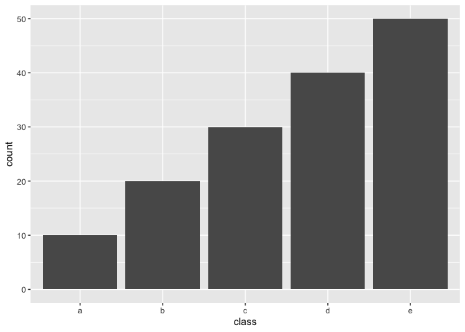
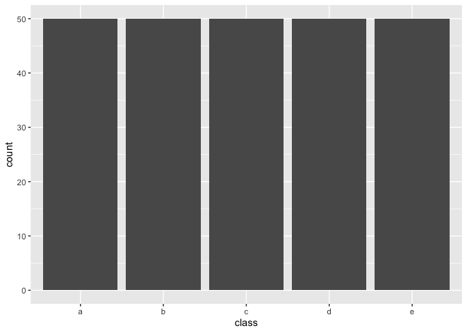
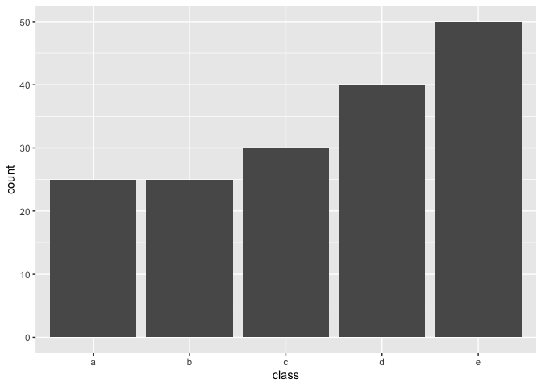
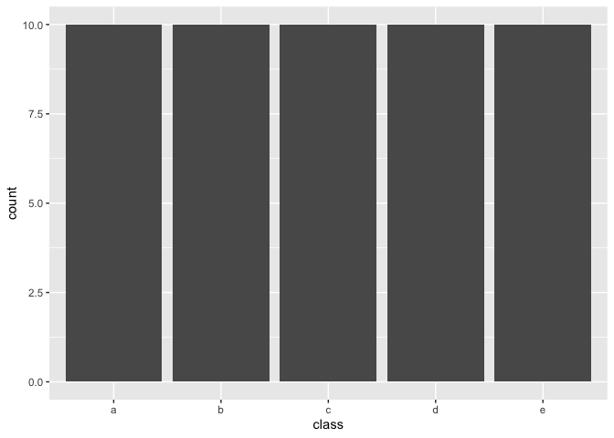
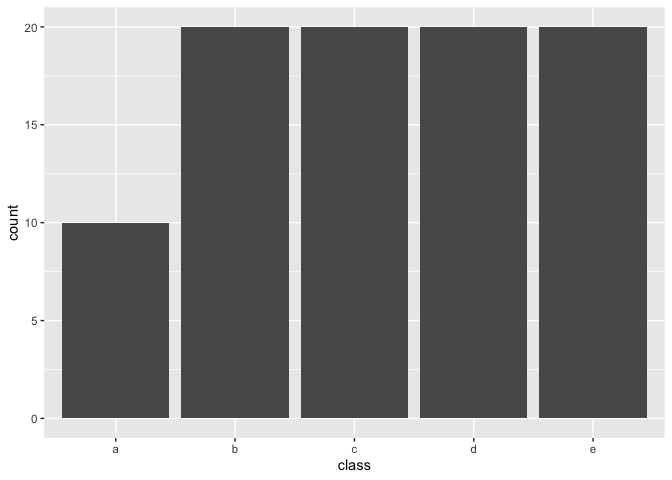

<!-- README.md is generated from README.Rmd. Please edit that file -->

# themis

<!-- badges: start -->

[](https://github.com/tidymodels/themis/actions/workflows/R-CMD-check.yaml)
[](https://app.codecov.io/gh/tidymodels/themis?branch=main)
[](https://CRAN.R-project.org/package=themis)
[](https://CRAN.R-project.org/package=themis)
[](https://lifecycle.r-lib.org/articles/stages.html)
<!-- badges: end -->

**themis** contains extra steps for the
[`recipes`](https://CRAN.R-project.org/package=recipes) package for
dealing with unbalanced data. The name **themis** is that of the
[ancient Greek
god](https://thishollowearth.wordpress.com/2012/07/02/god-of-the-week-themis/)
who is typically depicted with a balance.

## Installation

You can install the released version of themis from
[CRAN](https://CRAN.R-project.org) with:

``` r
install.packages("themis")
```

Install the development version from GitHub with:

``` r
require("devtools")
install_github("tidymodels/themis")
```

## Example

Following is a example of using the
[SMOTE](https://jair.org/index.php/jair/article/view/10302/24590)
algorithm to deal with unbalanced data

``` r
library(recipes)
library(modeldata)
library(themis)

data("credit_data")

credit_data0 <- credit_data %>%
  filter(!is.na(Job))

count(credit_data0, Job)
#>         Job    n
#> 1     fixed 2805
#> 2 freelance 1024
#> 3    others  171
#> 4   partime  452

ds_rec <- recipe(Job ~ Time + Age + Expenses, data = credit_data0) %>%
  step_impute_mean(all_predictors()) %>%
  step_smote(Job, over_ratio = 0.25) %>%
  prep()

ds_rec %>%
  bake(new_data = NULL) %>%
  count(Job)
#> # A tibble: 4 × 2
#>   Job           n
#>   <fct>     <int>
#> 1 fixed      2805
#> 2 freelance  1024
#> 3 others      701
#> 4 partime     701
```

## Methods

Below is some unbalanced data. Used for examples latter.

``` r
example_data <- data.frame(class = letters[rep(1:5, 1:5 * 10)],
                           x = rnorm(150))

library(ggplot2)

example_data %>%
  ggplot(aes(class)) +
  geom_bar()
```



### Upsample / Over-sampling

The following methods all share the tuning parameter `over_ratio`, which
is the ratio of the majority-to-minority frequencies.

| name                                                            | function                  | Multi-class        |
|-----------------------------------------------------------------|---------------------------|--------------------|
| Random minority over-sampling with replacement                  | `step_upsample()`         | :heavy_check_mark: |
| Synthetic Minority Over-sampling Technique                      | `step_smote()`            | :heavy_check_mark: |
| Borderline SMOTE-1                                              | `step_bsmote(method = 1)` | :heavy_check_mark: |
| Borderline SMOTE-2                                              | `step_bsmote(method = 2)` | :heavy_check_mark: |
| Adaptive synthetic sampling approach for imbalanced learning    | `step_adasyn()`           | :heavy_check_mark: |
| Generation of synthetic data by Randomly Over Sampling Examples | `step_rose()`             |                    |

By setting `over_ratio = 1` you bring the number of samples of all
minority classes equal to 100% of the majority class.

``` r
recipe(~., example_data) %>%
  step_upsample(class, over_ratio = 1) %>%
  prep() %>%
  bake(new_data = NULL) %>%
  ggplot(aes(class)) +
  geom_bar()
```



and by setting `over_ratio = 0.5` we upsample any minority class with
less samples then 50% of the majority up to have 50% of the majority.

``` r
recipe(~., example_data) %>%
  step_upsample(class, over_ratio = 0.5) %>%
  prep() %>%
  bake(new_data = NULL) %>%
  ggplot(aes(class)) +
  geom_bar()
```



### Downsample / Under-sampling

Most of the the following methods all share the tuning parameter
`under_ratio`, which is the ratio of the minority-to-majority
frequencies.

| name                                            | function            | Multi-class        | under_ratio        |
|-------------------------------------------------|---------------------|--------------------|--------------------|
| Random majority under-sampling with replacement | `step_downsample()` | :heavy_check_mark: | :heavy_check_mark: |
| NearMiss-1                                      | `step_nearmiss()`   | :heavy_check_mark: | :heavy_check_mark: |
| Extraction of majority-minority Tomek links     | `step_tomek()`      |                    |                    |

By setting `under_ratio = 1` you bring the number of samples of all
majority classes equal to 100% of the minority class.

``` r
recipe(~., example_data) %>%
  step_downsample(class, under_ratio = 1) %>%
  prep() %>%
  bake(new_data = NULL) %>%
  ggplot(aes(class)) +
  geom_bar()
```



and by setting `under_ratio = 2` we downsample any majority class with
more then 200% samples of the minority class down to have to 200%
samples of the minority.

``` r
recipe(~., example_data) %>%
  step_downsample(class, under_ratio = 2) %>%
  prep() %>%
  bake(new_data = NULL) %>%
  ggplot(aes(class)) +
  geom_bar()
```



## Contributing

This project is released with a [Contributor Code of
Conduct](https://contributor-covenant.org/version/2/0/CODE_OF_CONDUCT.html).
By contributing to this project, you agree to abide by its terms.

-   For questions and discussions about tidymodels packages, modeling,
    and machine learning, [join us on RStudio
    Community](https://community.rstudio.com/new-topic?category_id=15&tags=tidymodels,question).

-   If you think you have encountered a bug, please [submit an
    issue](https://github.com/tidymodels/themis/issues).

-   Either way, learn how to create and share a
    [reprex](https://reprex.tidyverse.org/articles/articles/learn-reprex.html)
    (a minimal, reproducible example), to clearly communicate about your
    code.

-   Check out further details on [contributing guidelines for tidymodels
    packages](https://www.tidymodels.org/contribute/) and [how to get
    help](https://www.tidymodels.org/help/).
